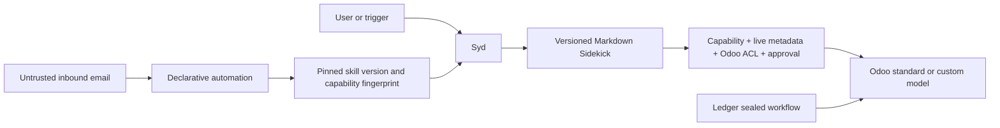

# Sydekyks Desktop — Dynamic Sidekicks Build Report

## Document control

| Field                           | Value                                                          |
| ------------------------------- | -------------------------------------------------------------- |
| Product                         | Sydekyks Desktop 1.0.0                                         |
| Report date                     | 2026-07-25 (Europe/Paris)                                      |
| Audit branch                    | `feat/dynamic-sidekicks`                                       |
| Tested implementation           | `12e6b3c75c5214b6d6ad858db6f4d20a61f3224f`                     |
| Pre-refactor snapshot           | `976bbcbb03a5ccdbfa622e2287f82023a71d5bd9`                     |
| Repository                      | `https://github.com/ibassoftware/sydekyks.git`                 |
| Internal acceptance             | **PASS**                                                       |
| Unrestricted production release | **CONDITIONAL NO-GO** pending the external release gates below |

This report describes the implementation commit above. The report itself is committed separately so the reviewed source revision remains immutable.

## Executive result

The fixed Nudge, Mirror, and Shield specialist implementations have been replaced by a single Syd runtime with dynamically managed Sidekicks. A Sidekick is a versioned Markdown skill plus an explicit capability set; it is not a separate hard-coded agent or workflow. Users can create and revise Sidekicks through chat.

Odoo access is now metadata-driven. Syd discovers models and fields from the connected Odoo instance, including custom models, and can use generic read/create/update/archive operations. Product prompts and UI can use friendly business language without treating names such as `crm.lead` as a fixed product boundary. Record deletion is intentionally unsupported.

Automations are declarative specifications with manual, schedule, or inbound-email triggers. They pin a Sidekick version and capability fingerprint and stop for review if either drifts. The user describes the desired process; the application stores a constrained specification rather than generating arbitrary executable code.

Ledger remains a sealed specialist workflow because its accounts-payable ingestion and review path has stricter deterministic controls.

Provider-facing tool definitions now use a JSON Schema object at the root. The test suite converts
every tool registered on Syd through Mastra's provider-schema compatibility layer and rejects any
non-object root. This corrects the OpenAI registration failure previously reported for
`writeOdooBusinessData`.

The refactor changed 84 files, added 2,450 lines, and removed 8,516 lines. Obsolete specialist agents, services, tools, workflows, tests, UI branches, and styling were deleted rather than retained as dead compatibility paths.

## Architecture delivered

The effective authorization for an Odoo mutation is the intersection of:

1. the connected Odoo user's source-system ACLs;
2. live model and field metadata;
3. the Sidekick's explicit model/operation capability;
4. Gadget connection policy; and
5. a native interactive approval for a write.

A Markdown skill can explain how to perform a task, but cannot grant itself access or bypass these controls.

## Material changes

### Dynamic Sidekicks

- Added persisted Sidekick profiles, immutable Markdown skill versions, and model/operation capabilities.
- Added chat tools to list, create, update, pause, and grant capabilities to Sidekicks.
- Added source-controlled Nudge, Mirror, and Shield starter skills under `skills/`, compiled into the packaged worker during the build.
- Removed the runtime Nudge, Mirror, and Shield agents, delegation tools, intelligence services, manifests, specialist tools, and specialist workflows.
- Replaced the fixed roster UI with a dynamic Sidekicks view.
- Added an accessible `SKILL.md` viewer to each Sidekick card with a rendered preview, raw Markdown
  source, version/source identity, keyboard-safe tabs, and copy-to-clipboard.
- Built-in Sidekicks show their repository source path; chat-created skills are explicitly labeled
  as local database records rather than physical source files.
- Eliminated the deterministic interpretation of initials such as “MW”; Syd must resolve people from live Odoo data and must not guess an identity or record ID.

### Generic Odoo access

- Removed hard-coded writable-model allowlists.
- Added live model and field discovery for standard and custom Odoo modules.
- Added generic create, update, and archive operations with capability checks and native approval.
- Rejected writes to fields reported as read-only by Odoo.
- Preserved Odoo as the authoritative source for access control.
- Added auditable Mission Control records for generic mutations.
- Deliberately excluded hard deletion.

### Declarative automations

- Replaced specialist automation proposal and execution services with generic automation specifications.
- Added manual, schedule, and inbound-email trigger types.
- Added pinned Sidekick versions and capability fingerprints.
- Added drift detection that stops execution and marks the automation as needing attention.
- Treats inbound email content and metadata as untrusted input.
- Does not silently approve background writes: approval-required actions still require an interactive approval.

### Ledger email-to-bill intake

- Added read-only inspection and approval-gated configuration tools for Ledger's sealed inbox path.
- Syd now distinguishes Ledger inbox processing from generic Sidekick automations.
- A user can request a polling cadence in plain language; `1,440` minutes means once per day.
- Review modes support review-everything, automatic high-confidence drafts, or automatic complete drafts.
- Automatic handling still creates draft vendor bills only and retains duplicate, completeness, Odoo, and workflow controls.
- Polling changes are retained in Gadget state and reconciled with the encrypted IMAP configuration on restart.
- The chat, Automations, and Email Gadget UI now provide an example prompt for this path.

### Provider tool-schema compatibility

- Replaced the Odoo write tool's root discriminated union with a provider-compatible object schema.
- Preserved operation-specific create/update/archive validation inside the tool.
- Added a regression check over every tool registered on Syd.

### Data migration and rollback posture

- The application database schema is upgraded to version 4.
- Existing Nudge, Mirror, and Shield automation rows are imported once as generic, read-only automation specifications when the legacy table exists.
- The legacy automation table is retained for rollback compatibility but is no longer read by the active runtime.
- New user Sidekick versions are append-only; updates do not rewrite prior skill text.

## Verification evidence

All commands below passed against implementation commit `12e6b3c75c5214b6d6ad858db6f4d20a61f3224f`.

| Area                                                     | Command                              | Result                              |
| -------------------------------------------------------- | ------------------------------------ | ----------------------------------- |
| Type safety                                              | `npm run typecheck`                  | PASS                                |
| Lint                                                     | `npm run lint`                       | PASS                                |
| Dynamic Sidekicks, provider schemas, and Odoo mutation   | `npm run test:sidekicks`             | PASS                                |
| Syd Odoo metadata discovery and write gating             | `npm run test:syd-odoo-read`         | PASS                                |
| Mission failure detail                                   | `npm run test:mission-errors`        | PASS                                |
| Mission notifications                                    | `npm run test:mission-notifications` | PASS                                |
| Database recovery and migration                          | `npm run test:recovery`              | PASS                                |
| Provider policy                                          | `npm run test:ai-provider-policy`    | PASS                                |
| Provider restoration                                     | `npm run test:ai-restore`            | PASS                                |
| OpenAI model handling                                    | `npm run test:openai-models`         | PASS                                |
| Logging controls                                         | `npm run test:logging`               | PASS                                |
| UI contrast                                              | `npm run test:ui-contrast`           | PASS; lowest text 6.80:1, UI 3.50:1 |
| Production compilation                                   | `npm run build`                      | PASS                                |
| Built worker authentication, health, first run, shutdown | `npm run test:smoke:worker`          | PASS on loopback port 57546         |
| Patch hygiene                                            | `git diff --check`                   | PASS                                |

The Sidekick integration test converts every tool registered on Syd through Mastra's provider-schema
adapter and confirms that each function has an object root. It also creates a user-defined `Renewals`
Sidekick, grants access to the custom demo model `x_rental.contract`, exercises
create/update/archive operations, verifies mutation audit records, and confirms that a Sidekick
without the capability is rejected.

### Build output

Mastra and Electron Vite production builds completed successfully on 2026-07-25.

| Artifact                   |        Size | SHA-256                                                            |
| -------------------------- | ----------: | ------------------------------------------------------------------ |
| `.mastra/output/index.mjs` | 1,876.35 kB | `3bd2e46afb9c9e21171cd426ce4cf2ab132c4b38e8b72c71a14fda9740875007` |
| `out/main/index.js`        |   596.28 kB | `e4f95dc7c7d65a6ab47c63e94c2575c3c68c3c67262445ec323635912d0072fa` |
| `out/preload/index.js`     |     4.38 kB | `732143a95ca186af8b05b07e897e147095bf7665e2e2ada29ae6188b726d1e90` |
| `out/renderer/index.html`  |     0.60 kB | `2102c4f8d6a76b6c8a81b22a5ea970499dc4a597d45f82098d8bd6d98c74e37a` |

The renderer JavaScript bundle is 1,414.60 kB and its CSS bundle is 92.09 kB.

## Security and control assessment

- Sidekick creation stores constrained Markdown and configuration; it does not generate or execute arbitrary JavaScript.
- Sidekicks cannot self-grant capabilities.
- Every generic Odoo write requires an exact Sidekick model/operation capability and a native tool approval.
- Live Odoo metadata is checked before mutation, and source-system ACLs remain authoritative.
- Hard record deletion is not exposed.
- Inbound email does not receive authority merely by describing an action.
- Changing recurring Ledger inbox handling requires native approval and creates an audit mission.
- Automation version or capability drift fails closed.
- Odoo mutations create Mission Control audit records with the acting Sidekick and affected record references.
- Stored connection secrets use the existing operating-system `safeStorage` path.
- Provider selection remains centralized and was covered by the provider-policy tests.

## Known limitations

- A background automation cannot silently perform an approval-required write. It must surface the proposed write for an interactive approval.
- Metadata-driven discovery depends on the connected Odoo user having permission to read the relevant model and field metadata.
- Ledger is intentionally still a fixed, sealed workflow and is not represented as a general user-created Sidekick.
- The old automation table remains in upgraded databases for rollback; active code does not read it.
- The renderer bundle is functional but large and should be split or budgeted before scale-sensitive distribution.

## External release gates not completed

These items require release infrastructure, external services, credentials, or authorization that were not available in this build session:

- signed and notarized macOS package;
- production update feed and rollback exercise;
- clean-machine installation and upgrade from the currently distributed version;
- packaged-application smoke and package-content audit;
- full live AI-provider functional matrix;
- live Odoo validation against representative standard and custom modules, including ACL-denied cases;
- GreenMail or equivalent end-to-end inbound-email trigger test;
- dependency vulnerability audit, SBOM, and license review;
- production telemetry, support, backup, and incident-response sign-off.

`npm audit --omit=dev --audit-level=high` was not run. The requested execution was denied because it would disclose the dependency manifest to npm's external advisory service without explicit authorization. The release owner or auditor should authorize and run this gate in the approved supply-chain environment.

## Go-live assessment

**Ready for auditor handoff and controlled local/UAT testing.**

**Not yet approved for unrestricted production go-live.** Production release should remain blocked until the external gates above are evidenced and signed off. No known internal compile, lint, Sidekick authorization, generic Odoo mutation, recovery, or worker-smoke failure remains in the tested revision.
