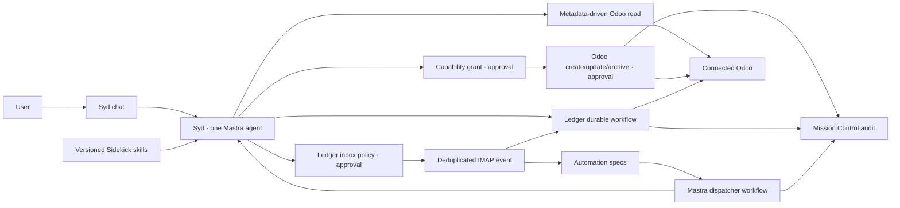

# Sydekyks architecture

## Decision record

The product uses one Mastra agent runtime—Syd—and composes business behavior from versioned skills.
We do not create one coded agent and workflow per business specialization. This prevents standard
Odoo technical identifiers, fixed field sets, and anticipated modules from becoming permanent
integration boundaries.

Ledger is the deliberate exception. Vendor-bill processing remains a sealed durable workflow because
it has specialized accounting validation, sequential configuration approvals, idempotence, and
read-back verification.

## Runtime map



## Sidekick model

A Sidekick is application data:

- stable slug and display name;
- description used by Mastra skill selection;
- Markdown instructions;
- preset or user source;
- active or paused status;
- monotonically increasing version;
- content hash;
- separate entity capability grants.

Every content change appends `sidekick_versions`. The active records are converted to Mastra inline
skills at request time with `createSkill()`. A prompt cannot add a skill or change its authority
without invoking an approval-gated management tool.

Preset Markdown lives under `skills/<id>/SKILL.md`. `scripts/sync-preset-skills.mjs` validates the
frontmatter and creates the generated package seed. A changed preset creates a new database version
on next startup.

## Odoo model

The integration starts from live metadata:

1. `ir.model` discovery returns a friendly label and technical handle.
2. `fields_get` returns labels, types, required/readonly state, relationships, selections, help, and
   storage state.
3. reads use bounded domains, fields, limits, and offsets;
4. writes validate the entity and submitted fields immediately before execution.

There is no standard-model write allowlist. Custom identifiers such as `x_rental.contract` follow
the same path as core Odoo models. Source Odoo ACLs remain authoritative.

Capability grants have the form:

```ts
{
  sidekickId: string
  model: string
  label: string
  operations: Array<'read' | 'create' | 'update' | 'archive'>
}
```

The model handle is internal. The user approves a friendly label plus operations. Capability grants
and writes are separate approvals. Deletes are not available through the generic tool.

Provider-facing tool schemas always have a JSON Schema object at their root. Operation-specific
variants are represented as fields on that object and validated again inside the tool. This keeps
create/update/archive rules strict while remaining compatible with function-calling providers that
reject a union at the schema root.

## Approval boundary

Skills provide reasoning instructions. They cannot:

- register tools;
- grant capabilities;
- enable live Odoo writes;
- bypass Odoo ACLs;
- bypass native tool approval;
- expand an automation’s pinned scope.

All generic writes use Mastra tool approval. The renderer sends an approval response only after the
user acts on the chat card. The execution then rechecks the active Sidekick, exact capability,
discovered entity, live fields, and Gadget mode before calling Odoo.

## Automation model

An automation is declarative:

- Sidekick ID and pinned version;
- prompt;
- manual, schedule, or email trigger;
- read-only or interactive-approval policy;
- missed-run behavior;
- capability fingerprint;
- lifecycle and last-run audit fields.

The dispatcher is one trusted Mastra workflow. It interprets schedule records; it does not compile
or evaluate model-produced source code. IMAP triggers pass normalized metadata as untrusted data.

Before every run, the interpreter compares the pinned Sidekick version and capability fingerprint.
Drift creates a needs-attention mission and stops the run. A reviewed automation can be explicitly
re-pinned.

## Ledger inbox model

Ledger's email-to-bill intake is a sealed integration boundary, not a generic Sidekick automation.
The IMAP Gadget polls at its approved interval, deduplicates and stores new messages, and hands likely
vendor bills to Ledger's document analysis and durable draft workflow.

Syd exposes separate read-only inspection and approval-gated configuration tools for this path. The
configuration records:

- the inbox polling interval (`1440` minutes for once daily);
- review every detected bill;
- automatically prepare only complete, high-confidence, warning-free drafts; or
- automatically prepare every complete item classified as a vendor bill.

Automatic handling still creates Odoo drafts only. Missing required fields stop for review, workflow
configuration approvals remain in force, duplicate checks still run, and the Odoo Gadget's live-write
setting remains authoritative. The non-secret polling preference is kept with Gadget state and is
reconciled into the encrypted IMAP configuration on restart.

## Storage

Application SQLite schema version 4 adds:

- `sidekicks`;
- `sidekick_versions`;
- `sidekick_capabilities`;
- `automation_specs`.

Old specialist automations are copied once into generic read-only specs. The old table is retained
only for rollback compatibility and is not read by the new runtime.

## Removed architecture

The refactor deletes:

- Nudge, Mirror, and Shield agent registrations;
- their delegation tools, intelligence agents, services, manifests, and workflows;
- specialist automation proposal/dedup services;
- direct run-now API routes;
- hardcoded specialist Mission Control builders and result views;
- obsolete specialist-only tests and CSS.

Nudge, Mirror, and Shield remain as Markdown preset skills, preserving their business guidance
without preserving code-level silos.

## Packaging and release

Preset skills are compiled into the Mastra output, so the packaged worker does not read source paths.
User Sidekicks remain in the application database. Release artifacts must still pass signing,
notarization, update-feed, clean-machine, and supply-chain gates recorded in the root build report.
