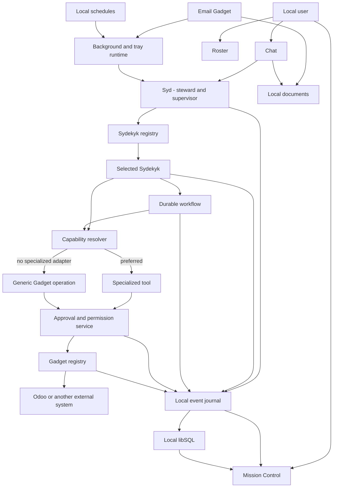
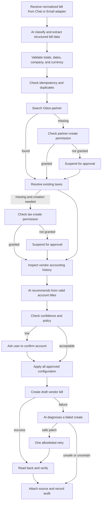

# Sydekyks Architecture

Status: Packaged local runtime, Ledger, inbound email, Nudge, Mirror, Shield, and local automations implemented; authoring kit proposed  
Audience: Product, engineering, and future Sydekyk authors  
Runtime target: Local-first Electron desktop application, one installation per user

## Executive summary

Sydekyks is a local-first desktop agent platform with a superhero metaphor:

- **Syd** is the user-facing steward and main supervisor agent. Syd understands intent, delegates work, coordinates multiple specialists, and communicates with the user.
- A **Sydekyk** is a narrowly scoped specialist. Each Sydekyk receives only the tools, workflows, memory, and Gadgets required for its mission.
- A **Workflow** is a deterministic, durable business process. Agents decide what should happen; workflows control how sensitive or repeatable work happens.
- A **Gadget** is a configured connection to an external system such as Odoo, an IMAP mailbox, or a future document service.
- The **AI Gadget** is the user's selected OpenAI, Anthropic, Google, or Ollama Cloud provider and model. Its key is encrypted by the operating system and unlocked only into the local runtime.
- **Mission Control** is the adaptable operational interface for runs, approvals, schedules, Gadget health, and completed work.
- The **Roster** is the user-facing catalog of installed Sydekyks and their available capabilities.

The platform must be useful before specialized integration tools are implemented. It therefore provides a generic, validated Odoo Gateway as an internal baseline. Specialized tools are preferred when available; otherwise a Sydekyk may use safe generic operations behind the same capability, approval, verification, and audit boundaries. This is transport reuse, not a manual or deterministic substitute for AI judgment.

All state is stored locally under Electron's per-user application-data directory. Separate file-backed libSQL databases isolate Mastra memory/workflow snapshots from application records. Electron takes bounded startup backups before opening an existing database set, and the worker uses process-scoped SQLite shutdown because its embedded Mastra adapter owns multiple domain connections that are released together at process exit. Documents remain on the local filesystem. Secrets are protected with Electron's OS-backed `safeStorage`.

## Implemented MVP snapshot

The current vertical slice implements the architectural spine rather than a disconnected prototype:

- Syd is a Mastra supervisor. Its bounded delegation tools invoke least-privilege Ledger, Nudge, Mirror, or Shield agents and return the specialist's final response plus a structured work report derived from actual tool calls and outcomes. Chat never renders raw provider reasoning or private chain-of-thought.
- Ledger owns a durable vendor-bill workflow with totals and active-currency validation, vendor-scoped duplicate detection, partner lookup, AI vendor-history analysis, AI account and tax recommendations, protected configuration creation, draft creation, and read-back verification.
- Missing-partner and missing-tax creation suspend at typed approval steps and resume the same run after each decision. Remembered permissions are explicit application records, and both approvals can occur sequentially in one mission. Approved configuration is written only after every gate passes, preventing partial Odoo changes when a later approval is declined.
- The Odoo Gadget provides a real JSON-RPC adapter and a deterministic demo adapter behind one interface.
- The internal generic Odoo Gateway supports six validated operations; there is no arbitrary `execute_kw` surface or user-facing manual console. Syd exposes a bounded read-only subset for direct factual questions that do not match an installed specialist workflow. It discovers standard, custom, and metadata models through Odoo metadata, validates technical names and read bounds, and relies on the connected user's Odoo access rights as the read authority rather than maintaining a second application-level model or field denylist.
- The AI Gadget lets the user choose OpenAI, Anthropic, Google, or Ollama Cloud and an allowed model. Electron encrypts the API key with `safeStorage`; the renderer never receives a stored key.
- Electron stores live Odoo credentials with `safeStorage`, while the Mastra process holds the unlocked secret only in memory.
- The IMAP Gadget stores its credential separately with `safeStorage`, polls by UID cursor, deduplicates messages and bill attachments, and extracts text locally. A manifest-backed per-Sydekyk policy decides whether a complete bill waits for verification or enters its workflow automatically.
- Chat accepts PDF, PNG, and JPEG documents through browse or drag and drop. The chat adapter and MIME adapter normalize into the same Ledger document envelope, local content-addressed store, AI classifier, editable review card, and vendor-bill workflow.
- A tool-less internal **Ledger Intelligence** agent classifies documents, extracts schema-validated fields, compares vendor history, recommends allowlisted accounts and taxes, and diagnoses Odoo draft failures. It cannot access Gadgets or perform writes.
- Reviewed chat and email bills enter the same durable Ledger workflow. Completion is reconciled to the source record; email messages are additionally moved to the configured processed mailbox on a best-effort basis.
- **Nudge** is a hybrid CRM Sydekyk whose chat, manual, and scheduled triggers converge on one read-only workflow. It reads bounded opportunity, activity, and message facts through the Odoo Gateway, partitions larger contexts into bounded model batches, and uses a tool-less analyst to rank neglected opportunities with structured, candidate-bound output. Every input ID must appear exactly once before batch results are merged.
- **Mirror** is a read-only accounts-payable watchdog. Chat, manual, and scheduled triggers converge on `mirror-duplicate-bills`. The fact reader requires `move_type` and separates vendor bills from vendor credit notes before comparison. A first AI pass screens plausible compatible pairs using references, vendor/date/amount context, opaque Tax ID and bank fingerprints, and resubmission patterns. A second AI pass compares full line items and returns a confirmed or rejected verdict for every screened pair. Application code validates document compatibility, bill IDs, and pair coverage, but does not replace either judgment with duplicate-detection rules.
- **Shield** is a read-only accounts-payable risk sentinel. Chat, manual, and scheduled triggers converge on `shield-fraud-review`, which exposes the four phases **Watch**, **Assess**, **Rank**, and **Brief**. Code gathers bounded bill and vendor-change facts; AI assesses every supplied bill, and a separate AI synthesis produces the auditor brief. Code validates bill and evidence IDs, derives display bands from model scores, and orders the queue without deciding fraud risk. Sensitive vendor-master values are reduced to opaque fingerprints before model context.
- Local automations store semantic daily, weekday, weekly, or interval schedules in application records. One internal Mastra dispatcher checks due work each minute, atomically claims each run, and starts the owning Sydekyk workflow. Conversational proposals first compare the current inventory and stop on an equivalent job; an overlapping draft requires explicit confirmation. This keeps product schedules independent of the beta runtime API and preserves every-N-days cadence across month boundaries.
- Mission Control has Activity and Automations views for one-off checks, schedule creation, previews, pause/resume, run-now, editing, errors, and next-run visibility. Attention counts can be acknowledged without resolving their durable missions, and reopened work becomes unread again. Syd can also list and delete Nudge, Mirror, and Shield automations in Chat; deletion pauses on an exact-target approval card before any record is removed. The Roster advertises each Sydekyk's chat and schedule triggers and links to its owned automations.
- Mission Control, Roster, Gadgets, and Syd chat are working renderer surfaces. Chat provides isolated, persistent, auto-titled sessions backed by Mastra memory and uses the installed Sydekyk portraits for visible speaker and handoff identity. Structured Odoo record IDs become trusted links in Chat and Mission Control without relying on model-authored URLs. Workflow approvals appear in both surfaces; configured Nudge, Mirror, and Shield findings can raise an operating-system notification that focuses the relevant mission.
- Restart recovery has been exercised across a full Mastra shutdown while a Ledger approval was suspended.
- Electron owns the packaged Mastra worker lifecycle. It chooses a free loopback port, creates a random launch token, waits for health, restarts an unexpected exit, and terminates the worker gracefully before the desktop app quits. Renderer requests receive the connection only through the sandboxed preload bridge.
- The production archive excludes project databases, histories, test fixtures, source maps, type declarations, and Mastra Studio. A packaged first-run, authorization, renderer/preload, and clean-shutdown smoke suite audits the generated app.
- Desktop and worker processes emit owner-only rotating JSONL with recursive credential redaction. Production release builds additionally consume signed updates from an environment-supplied generic HTTPS feed; unsigned local audit builds have no feed.

The remaining delivery phases cover publishing and clean-machine acceptance of signed/notarized artifacts, tray/startup behavior, richer event projections, optional OCR, hosted email-webhook adapters, and the reusable Sydekyk authoring kit. See [Launch readiness](launch-readiness.md) for the external distribution gate.

## Architectural principles

1. **Least privilege by construction**

   A Sydekyk receives an explicit capability set. Tools are not globally inherited, and having access to a Gadget does not imply access to every action supported by that Gadget.

2. **Agents decide; workflows execute**

   Use agents for interpretation, judgment, planning, and conversational interaction. Use workflows for approvals, accounting processes, retries, schedules, and other known business procedures.

3. **Specialized first, generic integration baseline**

   Prefer narrow domain tools. When one does not exist, use a schema-aware generic integration operation internally. The model still supplies business judgment; generic transport is never presented as a manual intelligence fallback.

4. **Local-first and single-user**

   One installation represents one user. There is no SaaS tenant layer or remote application database. Odoo company boundaries still apply.

5. **Business truth is not LLM memory**

   Conversation memory may help an agent communicate, but permissions, schedules, workflow state, deduplication keys, audit events, and Odoo facts live in explicit records.

6. **One manifest, multiple consumers**

   The same Sydekyk manifest powers Syd's delegation, the Roster, Mission Control labels, capability enforcement, animations, and setup requirements.

7. **Every side effect is observable**

   Delegations, workflow transitions, approvals, Gadget calls, retries, failures, and completions emit typed events. User-facing reports summarize this runtime evidence without copying raw payloads or model chain-of-thought.

8. **Idempotency before autonomy**

   Repeated email delivery, retries, restarts, and duplicated user requests must not create duplicate business records.

9. **Intelligence is required for judgment**

   Classification, extraction, recommendation, diagnosis, and synthesis use the configured model. If AI is missing or fails, stop visibly. Deterministic code constrains and executes decisions; it does not impersonate intelligence.

10. **Structured identities cross product surfaces**

    External record identity, mission outcomes, and schedule state remain typed application data. Renderers may derive safe links and presentation from those facts, but prompts and model prose are not authoritative UI metadata.

Future Sydekyk authors must follow [Intelligence-first Sydekyk authoring](intelligence-first-authoring.md).

## Domain language

### Syd

Syd is the user-facing coordinator and steward. Technically, Syd is the primary Mastra supervisor agent and remains responsible for the overall user request while delegating focused work to Sydekyks.

Syd may:

- Interpret requests.
- Read the Roster and capability registry.
- Delegate to eligible Sydekyks.
- Start registered workflows.
- Surface workflow status and approval requests.
- Propose and manage approved automations.
- Synthesize results from one or more Sydekyks.

Syd should not receive unrestricted Odoo mutations or raw integration credentials.

### Sydekyk

A specialized agent, workflow owner, or both. Examples include:

- **Ledger** for vendor bills and accounting assistance.
- **Nudge** for CRM opportunity vigilance and follow-up recommendations.
- **Mirror** for duplicate vendor-bill intelligence.
- **Shield** for ranked accounts-payable risk review and auditor briefing.
- **Forge** for manufacturing operations.

A Sydekyk can be one of three forms:

- **Companion and operator:** conversational agent with workflows.
- **Companion only:** conversational specialist without operational workflows.
- **Automation only:** workflow package without a direct chat companion.

In Mastra terminology, a subagent is always an agent. In Sydekyks product terminology, a **Sydekyk** is the broader package and may contain an agent, one or more workflows, or both. A workflow-only Sydekyk is therefore an automation package Syd can invoke, not technically a Mastra subagent.

### Choosing an agent, tool, or workflow

Chat agents do not require workflows. Use the simplest primitive that provides the required control:

| Situation                                               | Preferred primitive        |
| ------------------------------------------------------- | -------------------------- |
| Answer, explain, interpret, reason, or ask a question   | Agent directly             |
| Perform one narrow, validated operation                 | Tool                       |
| Run a known multi-step process                          | Workflow                   |
| Require approvals, retries, recovery, or scheduling     | Workflow                   |
| Handle an open-ended task requiring several specialists | Syd delegating to Sydekyks |

The architectural rule is not that chat agents always prefer workflows. It is that structured, repeatable, resumable, or side-effecting business processes should be delegated to workflows. Agents may also invoke tools directly for bounded operations, and workflows may call agents inside individual steps when reasoning is needed.

### Gadget

A configured connection to an external system. A Gadget is not itself a permission grant. It describes connectivity and available capabilities; policy decides which capabilities a Sydekyk may use.

Initial Gadget types:

- Odoo
- IMAP email

Possible future Gadget types:

- Local folder watcher
- Cloud file storage
- Calendar
- Messaging channel
- OCR/document extraction provider

### Mission Control

The operational read model and UI for everything currently happening or recently completed. Mission Control consumes events and workflow state; it does not execute business logic itself.

### Roster

The catalog of installed Sydekyks. It tells the user what each Sydekyk can do, how it can be triggered, whether required Gadgets are connected, and whether it is currently active.

## System context



## Runtime topology

The production application is a packaged Electron application with local processes:

1. **Renderer process**

   Chat, Roster, Mission Control, approvals, settings, and Gadget setup.

2. **Electron main process**

   Window lifecycle, notifications, secure secret access, IPC boundaries, database backups, rotating diagnostics, update checks, and local-worker supervision. It generates one random bearer token per launch and never persists it.

3. **Local Mastra runtime**

   Syd, Sydekyks, workflows, tools, memory, schedules, and event emission. It runs as a packaged child process on a free `127.0.0.1` port, accepts only the launch token, and is never exposed on the LAN.

4. **Local persistence**

   Separate file-backed libSQL databases, a local documents directory, encrypted credential files, and the five most recent startup backups under Electron `userData`.

The application should support minimizing to the system tray and launching at login. Local email polling and schedules work only while the application or its background helper is running. If the computer is off, work resumes according to each automation's missed-run policy when Sydekyks starts again.

## Supervisor and delegation model

Use Mastra's supervisor-agent pattern: Syd is an `Agent` configured with eligible child agents through its `agents` property and invoked through `stream()` or `generate()`.

Do not build on the deprecated Mastra Agent Network API.

Syd delegation rules:

- Delegate only to a Sydekyk whose manifest matches the requested capability.
- Pass the minimum conversation context required for the task.
- Filter secrets, unrelated history, and untrusted attachment instructions from delegated context.
- Set a maximum number of delegation steps.
- Emit a `sydekyk.summoned` event before execution.
- Preserve Syd as the owner of the top-level run and user response.
- Return a shared `AgentWorkReport` built from actual tool calls and results, with safe labels for every Chat-visible tool.
- Surface propagated tool approvals and workflow suspensions in Chat and Mission Control.

Direct chat with a Sydekyk is allowed from the Roster, but operational actions still use the same workflow, permission, event, and Gadget services as Syd-routed requests.

### Transparency model

Sydekyks show receipts, not raw thoughts. While a delegation runs, Chat keeps the owner, factual current stage, and status visible. After it returns, the expandable specialist report shows the tools and data sources consulted, important verified facts, actions performed or proposed, a short **Why this conclusion?** explanation, confidence and uncertainty, approval requirements, and the specialist's final report. Mission Control provides the durable equivalent for workflow-only, email, manual, and scheduled runs.

The Specialist report keeps the Sydekyks-Bento dark editorial character through layered near-black surfaces, crisp borders, portraits, spacing, and restrained accent glows while maintaining readable type and measured contrast. Expanded report prose uses a compact `14/22` tier, supporting metadata uses `12–13/18–20`, and short labels use `11–12/16`; normal text meets `4.5:1`, and meaningful controls or icons meet `3:1`. Density is managed by progressive disclosure rather than 9–10 px or doubly muted evidence text. The collapsed row shows identity, outcome, status, and a one-line summary; the expanded hierarchy separates facts, actions, rationale, uncertainty, and final output.

Syd and every conversational Sydekyk speak to functional business users by default. User-facing answers lead with the business outcome, its practical meaning, and the next useful step; internal result codes, routing, schemas, model mechanics, tool names, and application IDs are translated or omitted. Technical implementation detail is available when the user explicitly asks for it, while domain facts, approval boundaries, uncertainty, and safety warnings remain precise.

An absent specialist is not by itself a reason to refuse a direct, read-only business-data question. Syd may discover the connected system's relevant schema and use a bounded, schema-validated Gadget read to answer ordinary factual questions. A matching specialist workflow still takes priority, and specialized judgment, recurring monitoring, and every write remain with an installed Sydekyk or a reviewed workflow. Syd must distinguish “the connected system does not expose this business area” from “the model exists and contains no matching records.”

Failed Mission Control cards use two layers. The visible summary names the last completed phase, the failed phase, what was and was not saved, and the practical next step. A collapsed **Error details** disclosure carries a stable safe code, stage, relevant AI configuration, sanitized validation or timeout detail, next step, and run ID for operators. Raw prompts, provider payloads, credentials, and retrieved business records are never persisted as UI diagnostics. A later failure must not rewrite history: if Watch read Odoo successfully and Assess failed, the mission says so.

Work reports are application-owned audit projections. They are derived from tool results, workflow events, approvals, and verified sources; they are not generated narratives of what the model might have considered. The report may contain safe operation labels, outcome states, concise evidence, confidence, rationale, and warnings. It must not contain provider reasoning tokens, hidden prompts, scratchpads, credentials, unrelated context, or unfiltered tool payloads.

Failed work reports use one concise outcome, one next step, and a collapsed technical-diagnostics section. The same failure summary must not be repeated as a fact, rationale, warning, and final narrative. The diagnostic retains the actual failed stage, safe validation path, model label, and error code; a successfully returned tool envelope must not be styled as a successfully completed specialist mission when its mission status is failed.

An agent that answers directly or asks a clarification returns no performed actions. It must not create decorative “thinking” stages. The live stage is a real lifecycle state; completed report fields are projected from validated tool and workflow outputs. If a domain result has no confidence score, the report says **Not scored**. The shared schema lives in `src/shared/agent-activity.ts`; future Chat-visible tools must register their safe label and data sources, then add a domain projection when their delegation adapter calls `buildAgentWorkReport`.

External record links follow the same evidence rule. Tools and workflows return validated record-identity fields and IDs; they do not return a model-authored tenant URL as authority. The renderer's shared Odoo-link adapter maps known specialist output fields and validated generic result identities, then builds the destination from the live Gadget's trusted base URL and database. Chat and Mission Control reuse the same accessible link component and fall back to a non-link record label when live Odoo is unavailable. A new Sydekyk that introduces a dedicated result field must extend the shared specialist mapping; dynamically discovered read-only records need no model-specific renderer change.

### Chat sessions and agent identity

Each item under **Sessions** is one Mastra memory thread owned by the fixed local Syd resource. The renderer creates, lists, loads, selects, and deletes those threads through authenticated local routes; it does not maintain a second conversation database. The selected thread ID is supplied in the chat request's `memory` option. Because Mastra recalls prior turns itself, the renderer sends only the new `UIMessage`, never the complete visible history. Stored messages are converted back to AI SDK v6 UI messages when a session is opened.

The thread ID also keys the renderer's Chat instance and all session-scoped presentation state. Selecting or creating a session remounts that state before history is loaded, so a new session renders an empty conversation and cannot flash messages, uploads, or pending UI from the previous thread. Durable uploaded-document records carry explicit session IDs rather than inheriting whichever session happens to be selected later.

Syd's memory enables asynchronous title generation. A new thread intentionally has no stored title so the first completed exchange can generate one; **New session** is only the temporary UI label. The sidebar periodically refreshes its local thread list so the generated title and latest update order appear without restarting the app.

Character source art lives in `rawphotos/`. Renderer-ready copies for installed Sydekyks live in `src/renderer/src/assets/portraits/` and should be resized for their actual UI role instead of bundling the multi-megabyte originals. Future installed agents should add their portrait to the shared `sydekyk-portraits.ts` registry and reuse it in the Roster, handoff receipt, and any direct speaking surface. Portraits establish identity; they do not authorize inventing private thoughts. All agents continue to follow the transparency model above: user-visible status, rationale, evidence, and verified work receipts are allowed, while hidden chain-of-thought and provider reasoning tokens are not.

## Sydekyk manifest and least privilege

Every Sydekyk is registered with one manifest:

```ts
type SydekykManifest = {
  id: string
  name: string
  role: string
  description: string
  mode: 'companion-operator' | 'companion-only' | 'automation-only'
  kind: 'agent' | 'workflow' | 'hybrid'
  workflowIds: string[]
  capabilities: string[]
  capabilityGrants: CapabilityGrant[]
  intelligence: IntelligenceMoment[]
  triggers: Array<'chat' | 'email' | 'schedule'>
  gadgets: string[]
  requiredGadgets: string[]
}

type CapabilityGrant = {
  gadget: string
  operations: Array<'read' | 'search' | 'create' | 'write'>
  models?: string[]
}

type IntelligenceMoment = {
  id: string
  purpose: 'classify' | 'extract' | 'recommend' | 'diagnose' | 'synthesize'
  outputSchema: string
  promptVersion: string
  required: true
  reviewBelowConfidence?: number
  allowedCandidateKinds?: string[]
}
```

Tool access is assembled from the manifest at runtime. There is no global bag of tools shared by all agents.

Examples:

- Ledger may receive vendor, invoice, tax, and chart-of-account capabilities.
- Nudge receives CRM lead, activity, and messaging reads but no CRM or accounting mutations.
- Mirror receives bill, line, vendor, and bank-identity reads but no accounting mutations.
- Shield receives bill, line, vendor, bank-identity, and vendor-change-history reads but no accounting mutations.
- Forge may receive manufacturing order and inventory reads without access to vendor bills.
- A conversational-only Sydekyk may receive no Gadget tools.

Capability enforcement must occur in application code at invocation time. Prompt instructions alone are not a security boundary.

## Capability resolution and generic integration

The resolver follows this ladder:

```text
Requested capability
  -> Is an authorized specialized tool installed and healthy?
       -> Yes: use it
       -> No: is an internal generic operation allowed by the Sydekyk manifest?
            -> Yes: construct a validated generic operation
            -> No: report the missing capability
  -> Does the resulting operation require approval?
       -> Yes: suspend and request approval
       -> No: execute
```

```ts
type CapabilityResolution =
  | {
      mode: 'specialized'
      capabilityId: string
      toolId: string
    }
  | {
      mode: 'generic'
      capabilityId: string
      gadgetId: string
      operation: GenericGadgetOperation
    }
  | {
      mode: 'unavailable'
      capabilityId: string
      reason: string
    }
```

Generic mode is a functional integration baseline, not an unrestricted escape hatch and not a cognitive fallback. The relevant agent or workflow must still use AI for business judgment.

For generic Odoo writes, the resolver must:

1. Discover the model schema and allowed fields.
2. Validate the model, operation, values, and field types.
3. Check the Sydekyk's capability grant.
4. Check an explicit denylist for high-risk operations.
5. Check stored user permission.
6. Produce a human-readable preview when approval is required.
7. Execute with an idempotency key.
8. Read the affected record back.
9. Emit an auditable result event.

Generic mode must not expose arbitrary Odoo server methods, raw code execution, deletion, invoice posting, payment actions, or module administration.

## Gadget architecture

### Gadget registry

```ts
type GadgetManifest = {
  id: string
  type: 'ai' | 'odoo' | 'imap' | string
  displayName: string
  status: 'ready' | 'degraded' | 'disconnected' | 'error'
  capabilities: GadgetCapability[]
  configurationSchema: unknown
  healthCheck(): Promise<GadgetHealth>
}
```

The Gadget registry owns:

- Connection metadata.
- Health checks.
- Capability discovery.
- Connection lifecycle.
- Mapping encrypted secret references to runtime clients.
- User-visible setup and troubleshooting status.

Secrets must not be stored in agent prompts, chat memory, manifests, Mission Control events, or ordinary database fields. Store encrypted values using Electron `safeStorage` and expose only short-lived clients to Gadget adapters.

### AI Gadget

The AI Gadget stores one active provider configuration for the installation:

```ts
type AiProviderConfiguration = {
  provider: 'openai' | 'anthropic' | 'google' | 'ollama-cloud'
  model: string
  encryptedApiKeyReference: string
}
```

The user chooses the provider and an allowed model in Gadgets, enters their own API key, and completes a structured-output connection test. For OpenAI, Electron calls the provider's model-list endpoint whenever the provider is opened or explicitly refreshed, then returns only sanitized text-generation model IDs to the renderer. The endpoint supplies identity metadata rather than capability metadata, so Sydekyks excludes known image, audio, realtime, embedding, moderation, search, and computer-use families by ID and treats the full structured-output connection test as authoritative. A curated OpenAI list remains available when there is no key or provider discovery fails.

Electron stores only the encrypted credential payload. A stored API key is decrypted only in the main process for model discovery or passed in memory to the local Mastra runtime; neither the key nor the provider response enters application records, model prompts, Mission Control, or renderer bootstrap data.

After startup or a renderer reload, Electron may unlock an already validated credential and restore it into the local runtime without calling the provider again. Remote model and structured-output validation belongs to the explicit **Test & save securely** action. AI, Odoo, and IMAP restoration run independently so a slow external Gadget does not block the rest of the interface; bounded retry handles the local worker coming online.

Syd and intelligence-dependent Sydekyks cannot run while the AI Gadget is disconnected. Existing inbound messages awaiting analysis remain recoverable and can be analyzed after the user connects a provider.

### Odoo Gadget

The generic Odoo Gadget is the foundational integration:

```ts
interface OdooGateway {
  fieldsGet(model: string): Promise<ModelSchema>
  checkAccess(model: string, operation: OdooOperation): Promise<boolean>
  search(model: string, domain: OdooDomain): Promise<number[]>
  read(model: string, ids: number[], fields: string[]): Promise<unknown[]>
  searchRead(model: string, domain: OdooDomain, fields: string[]): Promise<unknown[]>
  create(model: string, values: Record<string, unknown>): Promise<number>
  write(model: string, ids: number[], values: Record<string, unknown>): Promise<boolean>
}
```

Specialized Odoo tools reuse this gateway. They add business language, narrower schemas, better validations, and domain-specific completion checks without duplicating transport, authentication, retries, or audit logic.

### Email Gadget

The default local-first email Gadget uses IMAP:

```text
Mailbox
  -> Sync messages since stored cursor
  -> Deduplicate by message ID, source hash, and non-inline attachment hash
  -> Store non-inline attachments locally
  -> Extract labeled text and PDF text locally
  -> Ask Ledger Intelligence to classify and extract the document
  -> Evaluate Ledger's inbound verification policy
  -> Create a Mission Control verification record when required
  -> Otherwise hand a complete bill to Ledger automatically
  -> Enter Ledger's existing workflow in either case
  -> Reconcile completion and move the source message
```

The implemented adapter uses IMAPFlow, a UID/UIDVALIDITY cursor, bounded batches, message-size limits, and persistent application records. Email that arrives while the app is offline remains in the mailbox and is processed during the next synchronization. The source message is marked seen only after local ingestion succeeds. A future webhook provider such as Postmark can implement the same ingestion service when always-online delivery is required.

Email bodies and attachments are untrusted data. Their content must never override system instructions, capability grants, approval policies, or Gadget configuration. The parser bounds the extracted text before sending it to the configured Bill Intelligence model, while original files remain local. A local model should be configured when invoice data cannot leave the device.

Inbound verification is a Sydekyk policy, not a global email setting. Ledger currently supports `always`, `when-uncertain`, and `automatic`. `when-uncertain` requires a supported vendor-bill type, every required field, schema-valid totals and dates, document and field confidence at or above the threshold, and no model warnings. `automatic` may bypass routine field verification, but missing or invalid facts, unsupported credit notes, non-bills, protected Odoo operations, duplicate checks, and write failures still stop. Automatic handoff requests draft creation; it never bypasses the Odoo live-write switch, approval service, capability policy, or read-back verification. A newly installed Sydekyk declares its own default in its manifest and may omit inbound support entirely.

### Chat document intake

Chat is a second source adapter, not a second bill workflow:

```text
PDF, PNG, or JPEG selected in Chat
  -> Validate type and 15 MB size limit
  -> Store the original by content hash in the local documents directory
  -> Extract text locally when the PDF contains a text layer
  -> Send bounded text, or required visual/file input, to Ledger Intelligence
  -> Persist classification, confidence, evidence, warnings, and extracted fields
  -> Show the same editable Ledger document review component used by Mission Control
  -> Enter the existing Ledger vendor-bill workflow after explicit confirmation
```

The renderer uploads binary data to a dedicated local endpoint; it does not place base64 content in chat messages or Mastra conversation memory. Chat memory holds conversational text, while durable document state holds only metadata, the local path, hashes, intelligence output, review status, and workflow linkage. Up to five files may be selected at once and are analyzed sequentially so one provider error cannot corrupt another document's record.

Chat intake always shows a field review before starting the Odoo workflow. This is separate from Ledger's unattended inbound-email policy: an explicit user upload is already interactive, so the inline card is the natural confirmation surface. Once confirmed, both sources call the same workflow and approval services.

Visual input is capability-dependent. Text PDFs work with text-capable models. Image-only or scanned documents are sent as bounded multimodal input only when needed; a model/provider rejection becomes an explicit `AI setup required` record that can be reanalyzed after the AI Gadget changes. No manual rules engine silently replaces failed intelligence.

### Bill Intelligence boundary

Ledger Intelligence is a reusable, stateless Mastra agent with structured outputs and no tools. It is invoked from deterministic services at three judgment points:

1. **Document understanding:** classify bill, credit note, receipt, statement, or non-bill; extract fields, line-item clues, evidence, warnings, and per-field confidence.
2. **Accounting recommendation:** compare the current purchase with prior posted vendor bills and their account lines, then recommend one account and tax from candidates read by the Odoo Gadget.
3. **Write-failure diagnosis:** inspect the Odoo error, required-field metadata, draft payload, and allowed journal/currency/company candidates.

Model output never becomes authority by itself. The workflow rejects account or tax IDs absent from the supplied Odoo candidates. A write-recovery patch may contain only `journal_id`, `currency_id`, or `company_id`, must use a supplied ID, requires at least 75% confidence, and is attempted once. It cannot modify the vendor, reference, amounts, expense account, taxes, or invoice lines. If AI is unavailable, times out, or returns invalid output, the mission stops in an explicit setup-required, failed, or needs-attention state. There is no deterministic accounting fallback.

### Mirror and Shield intelligence boundaries

Mirror and Shield share a least-privilege accounts-payable fact reader, but not judgment code. The reader discovers available Odoo fields, bounds the requested history, normalizes bills and lines, and replaces Tax IDs and bank accounts with stable opaque fingerprints. The model never receives Odoo credentials or raw financial identifiers.

Mirror uses two required intelligence moments:

Before either moment, the reader requires `account.move.move_type` and retains only `in_invoice` vendor bills and `in_refund` vendor credit notes. Compatibility code permits pairs only when both records have the same `moveType`. This is a domain-valid containment boundary, not a duplicate heuristic: it prevents a credit note from being mislabeled as a resubmitted bill while preserving model judgment for bill-versus-bill and credit-note-versus-credit-note comparisons.

1. `mirror-screen-v1` selects every supplied compatible pair that plausibly merits full comparison. It may reason about similar references, close dates and amounts, split vendor records, identity fingerprints, or contextual resubmission patterns; code does not pre-classify pairs with fixed duplicate rules.
2. `mirror-confirm-v1` receives only screened pairs plus their full line facts, then confirms or rejects each pair. Application code requires exactly one verdict per allowed pair and permits one bounded semantic repair when the model invents, repeats, or omits a pair.

Shield keeps the user-visible sequence legible:

```text
Watch -> Assess -> Rank -> Brief
```

- **Watch** gathers recent vendor bills, their lines, and available vendor-master change facts. Missing field-level tracking is reported and limited record metadata is used as factual context; it is not interpreted as a risk rule.
- **Assess** asks `shield-assess-v1` to evaluate every supplied bill against the complete bounded context. The model owns the risk score, rationale, indicators, mitigating factors, and review recommendation.
- **Rank** validates the model's bill/evidence IDs, derives presentation bands from the validated score, and sorts the review queue. Sorting is execution, not risk judgment.
- **Brief** asks for the strongest supporting evidence in priority order. The prompt limits each alert to six evidence items and four auditor questions; application code deduplicates and bounds those presentation arrays before validating the persisted brief. This is output containment, not fraud-risk judgment. A Brief failure is recorded as **Brief**, even though Assess, Rank, and Brief share one workflow step.
- **Brief** asks `shield-brief-v1` to synthesize an evidence-backed auditor brief for exactly the ranked queue. A low score is not proof of safety, and a high score is not an accusation of fraud.

Both Sydekyks are read-only. If AI is unavailable or remains structurally invalid after the bounded repair attempt, the mission stops visibly instead of falling back to reference, amount, date, or score thresholds presented as intelligence.

## Ledger reference workflow

Ledger's vendor-bill workflow is the reference vertical slice:



Initial operational policy:

- Reads may run automatically when the Sydekyk has the capability.
- Partner and tax creation require a stored grant or approval. When both are missing, Ledger gathers both decisions before writing either record.
- Vendor bills are created as drafts.
- Posting bills, making payments, deleting records, and changing accounting configuration are separate high-risk capabilities and cannot use generic integration operations.

## Approval and permission service

Permissions are explicit application records:

```ts
type PermissionGrant = {
  id: string
  profileId: 'local-user'
  odooCompanyId?: number
  sydekykId: string
  capabilityId: string
  gadgetId?: string
  scope: 'once' | 'session' | 'persistent'
  constraints?: Record<string, unknown>
  grantedAt: string
  expiresAt?: string
  revokedAt?: string
  sourceRunId: string
}
```

Approval flow:

1. A workflow reaches a protected step.
2. The permission service searches for a matching non-revoked grant.
3. If no grant exists, the workflow suspends with a typed approval payload.
4. Chat and Mission Control show the same approval request, and Electron raises a native notification that opens Mission Control.
5. The user chooses decline, approve once, approve for this session, or persistently allow within the displayed scope.
6. The decision is stored and the exact workflow run resumes.

Persistent permission must be an explicit user choice. A conversational "yes" is not automatically a permanent grant.

## Triggers and task normalization

Chat, email, and schedules converge on one input contract:

```ts
type TaskEnvelope = {
  source: 'chat' | 'email' | 'schedule'
  profileId: 'local-user'
  odooCompanyId?: number
  conversationId?: string
  correlationId: string
  idempotencyKey: string
  text?: string
  attachments?: DocumentReference[]
  requestedSydekykId?: string
  metadata: Record<string, unknown>
}
```

Explicit routes can bypass Syd's classification step without bypassing policy:

- Selecting Ledger in the Roster routes directly to Ledger.
- A mailbox rule for vendor bills starts Ledger's bill workflow.
- A registered schedule starts its target workflow directly.
- Ambiguous chat or email goes through Syd.

## Local schedules and automations

Users can create automations in Mission Control or ask Syd conversationally. The visible product contract stores intent as a semantic schedule, never as an arbitrary cron expression:

```ts
type AutomationSchedule =
  | {
      kind: 'interval'
      every: number
      unit: 'days' | 'weeks'
      time: string
      timezone: string
      anchorAt: string
    }
  | {
      kind: 'calendar'
      daysOfWeek: number[]
      time: string
      timezone: string
    }

type AutomationDefinition = {
  id: string
  name: string
  ownerSydekykId: 'nudge' | 'mirror' | 'shield'
  workflowId: 'nudge-stale-opportunities' | 'mirror-duplicate-bills' | 'shield-fraud-review'
  schedule: AutomationSchedule
  inputData: Record<string, unknown>
  missedRunPolicy: 'skip' | 'run-on-start'
  status: 'draft' | 'active' | 'paused' | 'error'
  lastRunAt?: string
  nextRunAt?: string
}
```

Current creation and execution flow:

1. Mission Control creates an active schedule from explicit form controls. A chat request is interpreted by Syd and proposed as a **draft** so conversation alone cannot silently enable recurring work.
2. Before a conversational proposal writes anything, the service compares it with the fresh application-owned inventory. Equivalent means the same owner, workflow, semantic cadence, local time, timezone, workflow input and notification policy, and missed-run behavior. Cosmetic names, object-key order, and an interval's creation-derived anchor date do not make a second job distinct.
3. If an equivalent draft, active, paused, or errored job exists, the proposal returns that definition with `outcome: existing`, creates nothing, and asks whether to keep it or intentionally create another. The duplicate override defaults to false and can be set only after explicit user confirmation.
4. The UI previews cadence, timezone, read-only authority, missed-run behavior, and upcoming runs. The user activates, pauses, edits, runs, or deletes the automation in Mission Control. Chat may also list or delete definitions through Syd's platform-owned automation tools.
5. The application stores the semantic definition, input policy, next run, last run, last mission, and last error in local libSQL.
6. One internal `automation-dispatcher` Mastra workflow runs every minute. It finds due active definitions and atomically advances `nextRunAt` before starting work, preventing two dispatcher ticks from claiming the same occurrence.
7. The dispatcher invokes the same registered Sydekyk workflow used by Chat and **Run now**. It does not execute a free-form agent prompt.
8. The resulting mission is visible in Mission Control. Scheduled Nudge, Mirror, and Shield runs can raise a desktop notification for attention findings; users may also opt into a notification after clear runs.

Conversational automation management follows a stricter contract than conversational creation. Syd must read the current application-owned inventory, resolve the user's description to exact IDs, and ask for clarification when the match is ambiguous. The deletion tool is marked `requireApproval: true`; Mastra suspends it before `execute`, and the Chat UI sends the user's allow or decline decision back through the native tool-approval continuation. Approval is never inferred from the request itself. The service verifies that every selected ID still exists, then removes the exact set in one local database transaction. A decline is a no-op, and Syd cannot report success before the resumed tool returns. These inventory and lifecycle tools belong to Syd as platform operations rather than to any one specialist, so the same behavior applies to Nudge, Mirror, Shield, and future automation owners added to the shared schema.

Semantic interval schedules are anchored to a local calendar date and evaluated in their IANA timezone. “Every 3 days” therefore continues across month boundaries and preserves the chosen local wall-clock time through daylight-saving changes. Calendar schedules cover daily, weekdays, weekly, and selected weekdays without exposing cron syntax.

Mastra's runtime schedule API is beta in the installed `@mastra/core` version and accepts cron schedules. Keeping a single internal dispatcher schedule and a stable application-level semantic contract isolates that beta boundary and avoids creating or deleting runtime cron entries for every user edit.

The default missed-run policy is `run-on-start`: the first dispatcher tick after startup claims one overdue occurrence and then advances to the next future occurrence. `skip` discards an occurrence more than five minutes late. Fully local schedules cannot execute while the computer is powered off.

## Mission Control

Mission Control is a fluid, event-driven operational surface. It should adapt to the number and types of active runs without requiring a fixed dashboard layout.

### Responsibilities

- Show what Syd and each Sydekyk are doing now.
- Show workflows as understandable steps rather than raw traces.
- Collect items requiring user attention.
- Show recent completed work and resulting Odoo records.
- Show failed, retried, canceled, and suspended work.
- Show active schedules and their next runs.
- Show Gadget health and connection problems.
- Filter by Sydekyk, workflow, trigger, Gadget, status, and time.
- Provide run details without exposing secrets or irrelevant model internals.

### Adaptive sections

Mission Control is composed from read-model cards rather than hard-coded agent panels:

- **Now:** active Syd, Sydekyk, and workflow runs.
- **Needs attention:** approvals, missing information, disconnected Gadgets, and failed runs.
- **Automations:** upcoming, paused, recently fired, and missed schedules.
- **Recent missions:** completed work with outcomes and external record links.
- **Gadgets:** connection health, last successful operation, and setup state.

When a section is empty it can collapse. When many runs exist it can switch from cards to a grouped or tabular presentation. This adaptability belongs in the presentation layer; the event contract remains stable.

The default presentation favors progressive disclosure: the collapsed state shows the owner, outcome, status, and required action, while evidence and specialist detail live in expandable content. Text and controls must meet accessible contrast, keyboard focus must remain visible, and primary buttons, secondary actions, and links must be visually distinguishable without relying on color alone.

The navigation attention count represents unread attention, not the number of durable missions. **Clear notifications** sets `acknowledgedAt` only for currently waiting or needs-attention missions; it does not approve, resolve, delete, or remove those missions from Activity. A later transition back into an attention state clears the acknowledgement so new work becomes visible again.

### Event contract

```ts
type MissionEvent =
  | { type: 'mission.started'; runId: string; source: string; occurredAt: string }
  | {
      type: 'sydekyk.summoned'
      runId: string
      sydekykId: string
      taskSummary: string
      occurredAt: string
    }
  | {
      type: 'workflow.step.started'
      runId: string
      workflowId: string
      stepId: string
      occurredAt: string
    }
  | {
      type: 'workflow.step.completed'
      runId: string
      workflowId: string
      stepId: string
      occurredAt: string
    }
  | {
      type: 'approval.requested'
      runId: string
      approvalId: string
      occurredAt: string
    }
  | {
      type: 'gadget.operation.started'
      runId: string
      gadgetId: string
      capabilityId: string
      occurredAt: string
    }
  | {
      type: 'gadget.operation.completed'
      runId: string
      gadgetId: string
      capabilityId: string
      occurredAt: string
    }
  | { type: 'mission.completed'; runId: string; occurredAt: string }
  | { type: 'mission.failed'; runId: string; errorCode: string; occurredAt: string }
  | { type: 'mission.canceled'; runId: string; occurredAt: string }
```

Events are append-only. Projections build the current Mission Control view:

- `active_missions`
- `attention_items`
- `recent_missions`
- `automation_status`
- `gadget_status`

Mastra workflow snapshots remain authoritative for resumable workflow execution. Mission Control projections are rebuildable views, not the source of workflow truth.

The `sydekyk.summoned` event also drives the superhero entrance animation in Chat.

## Roster

The Roster reads the Sydekyk manifest registry and runtime health information.

Each entry shows:

- Name, avatar, color, and tagline.
- Mission/domain.
- Companion, operator, or automation-only mode.
- Available triggers.
- Authorized capabilities.
- Specialized versus internal generic integration mode.
- Required Gadget status.
- Current state: ready, working, awaiting approval, degraded, setup required, disabled, or error.
- Recent and active missions.
- Owned automations.
- A **Summon** action when a companion is available.

Example:

```text
Ledger
Vendor bills and accounting
Ready - AI and Odoo Gadgets connected

Nudge
CRM vigilance
Working - 1 active mission - 3 automations

Mirror
Duplicate-bill watchdog
Ready - read-only AI and Odoo Gadgets connected

Shield
Accounts-payable risk sentinel
Ready - Watch, Assess, Rank, and Brief available

Forge
Manufacturing operations
Setup required - Odoo manufacturing capability unavailable
```

Roster capability labels must be derived from the same grants enforced by the backend. The UI must not advertise a tool that the Sydekyk cannot actually invoke.

## Memory and persistence

### Local storage

Use file-backed libSQL under Electron's application data directory:

```text
Sydekyks/
  runtime/
    sydekyks-app.db
    sydekyks-mastra.db
    documents/
    inbound-email/
  backups/
    <startup timestamp>/
      sydekyks-app.db
      sydekyks-mastra.db
  logs/
    desktop.jsonl
    worker.jsonl
```

The MVP includes `@mastra/libsql` and `@mastra/memory`. Application records and Mastra state use separate database files to isolate their write domains. Startup snapshots include each database and any WAL/SHM companions as one recovery set; rollback always restores the set, never an individual file.

### Agent memory

Use Mastra memory for:

- Conversation history.
- Conversation summaries.
- User communication preferences.
- Working context for the current mission.

Do not use agent memory for:

- Permissions or approvals.
- Schedule definitions.
- Odoo facts.
- Workflow execution state.
- Deduplication.
- Gadget credentials.
- Audit records.

Semantic/vector memory is not required for the first release. Add it only when usage shows that message history and structured working memory are insufficient.

### Core application records

- `app_profile`
- `gadget_connections`
- `gadget_capabilities`
- `permission_grants`
- `approval_requests`
- `automation_definitions`
- `inbound_emails`
- `documents`
- `idempotency_keys`
- `mission_events`
- Mission Control projection tables

Mastra storage owns its workflow snapshots, schedules, messages, and runtime state. Application tables own product policy and user-facing records.

## Security and trust boundaries

- Only Electron main or the local worker may decrypt Gadget credentials.
- The local HTTP service binds only to `127.0.0.1`; all data and mutation routes require a timing-safe comparison against a random, per-launch bearer token.
- The renderer receives the ephemeral service connection through a context-isolated, sandbox-compatible preload bridge. Top-level navigation, webviews, arbitrary window schemes, and permission requests are denied.
- Renderer code receives connection status, never raw credentials.
- Tool access is built from the Sydekyk manifest and checked again at invocation.
- Gadget generic operations validate schemas and technical names, enforce operation and result bounds, and remain subject to source-system access controls.
- External text, email, documents, and Odoo content are untrusted input.
- Reads and writes are logged without storing secrets.
- Local diagnostics are JSONL, owner-only, size-rotated, retention-bounded, and recursively redact authorization, key, password, secret, cookie, credential, and token fields.
- High-risk operations require dedicated capabilities and cannot use generic integration operations.
- Every write uses an idempotency key where the target system permits it, plus local duplicate detection.
- LLM recommendations are schema-validated and candidate-bound; the model has no direct Gadget access.
- Odoo company context is explicit on every operational request.
- Document retention and deletion controls are local and user-visible.

## Failure and recovery

### Workflow recovery

Workflow snapshots are stored locally so suspended approvals and interrupted workflows can be recovered after restart.

### Database and process recovery

Electron snapshots both database sets before startup and retains five generations. Automated recovery tests create durable state, copy DB/WAL/SHM files, mutate the active state, restore the snapshot, and reopen the worker. The Mastra child is supervised and restarted after an unexpected exit. On intentional shutdown, the HTTP listener stops, application storage and logs flush, Mastra workers stop, and the process exits so all embedded domain connections are released together.

### Gadget failures

Classify failures as:

- Authentication required.
  Temporary failures may retry with bounded exponential backoff. Business validation failures do not retry automatically.

### Email deduplication

Use the mailbox cursor, message ID, full-source hash, non-inline attachment hash, and Ledger's workflow idempotency checks to prevent duplicate processing. Inline related assets such as signature logos are excluded so shared branding cannot suppress a valid invoice.

Protocol-level local tests use the pinned GreenMail Docker image in `compose.greenmail.yml`. Preloaded `.eml` fixtures exercise IMAP authentication, UID cursors, MIME and attachment retrieval, redelivery deduplication, non-bill classification, automatic or verified handoff, and processed-mailbox movement without contacting an external mail provider. Parser-only sample ingestion remains useful for fast UI testing but is not treated as an IMAP integration test.

### Scheduled work

Persist the semantic schedule, last run, next run, last mission, last error, and missed-run policy. The internal dispatcher is runtime-managed, while product automation records remain application-owned. On startup its first tick applies `run-on-start` or `skip` to overdue definitions. Atomic claiming advances the next occurrence before workflow execution, so a failed or slow run is not started twice.

## Suggested source structure

```text
src/
  main/
    background/
    notifications/
    secrets/
  mastra/
    index.ts
    automations/
      dispatcher-workflow.ts
      schedule.ts
      service.ts
    supervisor/
      syd-agent.ts
      delegation-events.ts
    sydekyks/
      contracts.ts
      registry.ts
      ledger/
        manifest.ts
        agent.ts
        intelligence-agent.ts
        intelligence-service.ts
        inbound-email.ts
        chat-document.ts
        delegation-tool.ts
        service.ts
        workflows/
          vendor-bill.ts
        tools/
          vendor-bill.ts
      nudge/
        manifest.ts
        agent.ts
        intelligence-agent.ts
        intelligence-service.ts
        service.ts
        tools/
        workflows/
      mirror/
        manifest.ts
        agent.ts
        intelligence-agent.ts
        intelligence-service.ts
        delegation-tool.ts
        service.ts
        tools/
        workflows/
      shield/
        manifest.ts
        agent.ts
        intelligence-agent.ts
        intelligence-service.ts
        delegation-tool.ts
        service.ts
        tools/
        workflows/
      shared/
        accounts-payable-facts.ts
      forge/
    gadgets/
      registry.ts
      odoo/
        odoo-gateway.ts
        generic-operations.ts
        model-policy.ts
        schemas/
        specialized-tools/
      email/
        imap-gadget.ts
    platform/
      approvals/
      capabilities/
      documents/
      events/
      idempotency/
      mission-control/
    contracts/
      task-envelope.ts
      mission-events.ts
      manifests.ts
  renderer/
    src/
      features/
        chat/
        roster/
        mission-control/
        gadgets/
        approvals/
```

## Delivery plan

### Phase 1: Local platform foundation

- File-backed libSQL and Mastra memory.
- Local application paths and backup strategy.
- Event journal and Mission Control projection infrastructure.
- Gadget registry and OS-backed secret storage.
- Capability registry and invocation-time enforcement.

### Phase 2: Odoo baseline

- Generic Odoo Gateway.
- Model and field discovery.
- Read operations.
- Validated internal create/write operations.
- Approval, audit, verification, and idempotency.
- Odoo Gadget setup and health UI.

### Phase 3: Syd, Roster, and Mission Control

- Syd supervisor and steward persona.
- Sydekyk manifest loader.
- Least-privilege tool binding.
- Roster UI.
- Mission Control active, attention, recent, automation, and Gadget views.
- Typed summon/progress/completion events and animations.

### Phase 4: Ledger vertical slice

- Ledger companion.
- Vendor-bill extraction and validation.
- Partner, tax, account-title, and draft-bill workflow.
- Specialized tools layered over generic Odoo operations.
- Suspend/resume approvals.

### Phase 5: Background triggers — partially implemented

- Implemented: IMAP Gadget, attachment handling, local extraction, deduplication, per-Sydekyk verification policy, automatic or reviewed handoff, and approval notifications.
- Implemented: semantic local schedules, internal Mastra dispatcher, atomic due-run claiming, `run-on-start`/`skip` policy, Mission Control automation management, and Nudge attention notifications.
- Implemented: Mirror's two-pass duplicate-bill intelligence and Shield's Watch/Assess/Rank/Brief risk-review workflow, with Chat, Run now, and schedule triggers sharing each named workflow.
- Proposed: tray mode and launch at login.
- Proposed: notifications for non-approval operational failures.

### Phase 6: Sydekyk authoring kit

- Manifest template.
- Capability declaration helpers.
- Workflow and event conventions.
- Test harness for Gadget mocks, approval suspension, and idempotency.
- Intelligence-moment declarations, structured-output fixtures, and provider-failure evals based on the intelligence-first authoring guide.
- Add manufacturing and other domain Sydekyks using the same contracts.

## Architectural decisions

### AD-001: Use a supervisor, not an agent network

Mastra supervisor agents are the supported direction in the installed runtime. Syd remains in control and delegates to registered Sydekyks.

### AD-002: Use file-backed libSQL

The product is a single-user downloadable application. An embedded local database provides persistence without operating PostgreSQL or another server.

### AD-003: Make generic Odoo transport an internal baseline

Sydekyks must work before every specialized integration tool exists. Specialized capabilities remain preferred, while validated generic reads and writes provide controlled internal transport. This does not replace model judgment and is not exposed as a manual console.

### AD-004: Enforce least privilege per Sydekyk

Agents receive only explicitly granted capabilities. Access is enforced in code and cannot be widened by prompts or delegated content.

### AD-005: Call connections Gadgets

Gadget is the product term for an external connection. Gadget implementations remain ordinary integration adapters in source code.

### AD-006: Build Mission Control from events and projections

Mission Control must remain fluid as new Sydekyks and workflows are added. Stable typed events allow flexible presentation without coupling UI layout to workflow implementation.

### AD-007: Prefer local IMAP ingestion

IMAP preserves the local-first distribution model and processes missed mail when the app restarts. Hosted webhook ingestion remains an optional Gadget for users who need processing while their computer is offline.

### AD-008: Require configured AI for intelligent work

The user selects OpenAI, Anthropic, Google, or Ollama Cloud and supplies their own API key through the AI Gadget. Classification, extraction, recommendation, diagnosis, and synthesis fail visibly when the provider is unavailable; deterministic business rules do not take over and masquerade as intelligence.

## Non-goals for the first release

- Multi-user collaboration.
- SaaS tenancy.
- Remote application database.
- A marketplace for untrusted Sydekyks.
- Arbitrary Odoo method execution.
- Autonomous invoice posting or payments.
- Semantic/vector memory without a demonstrated requirement.
- Guaranteed automation execution while the computer is powered off.

## Success criteria

- Adding a Sydekyk requires a typed registry/delegation entry and any domain-specific Mission Control card, but does not require changing the Odoo Gateway, scheduler engine, or core Roster renderer.
- A Sydekyk cannot invoke capabilities absent from its manifest.
- Ledger can create a validated draft bill through the generic Odoo Gateway before specialized integration tools exist, while AI remains responsible for accounting judgment.
- A suspended approval survives application restart and resumes the same workflow.
- Reprocessing the same email does not create a duplicate bill.
- Mission Control can reconstruct active and recent mission views from stored events.
- Gadget credentials never enter model context or renderer state.
- Local schedules, memory, and completed mission history survive application restarts.
